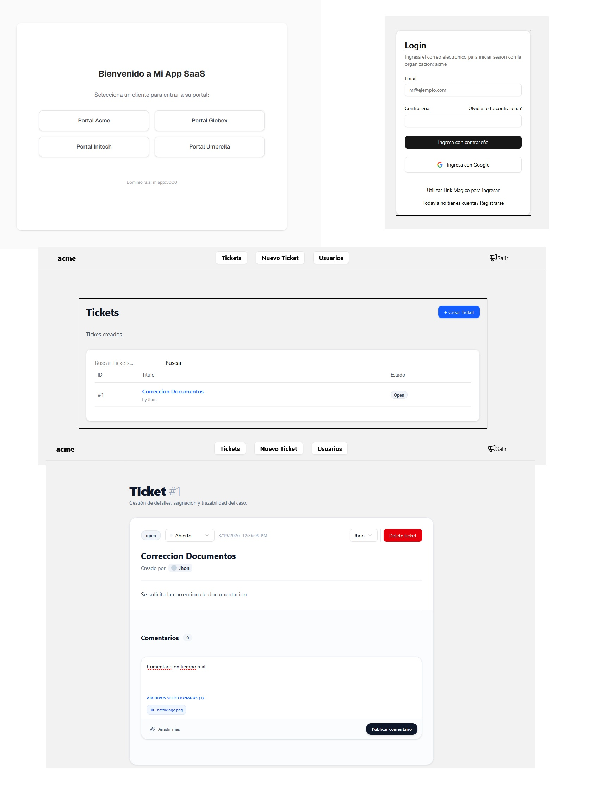
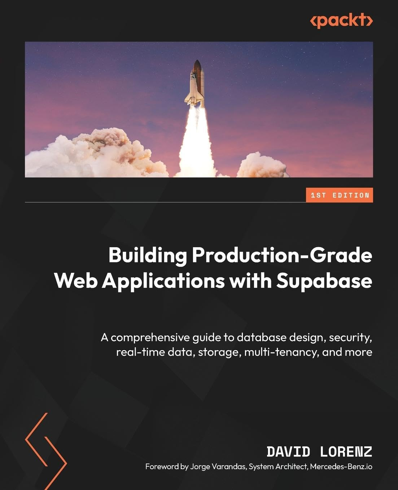
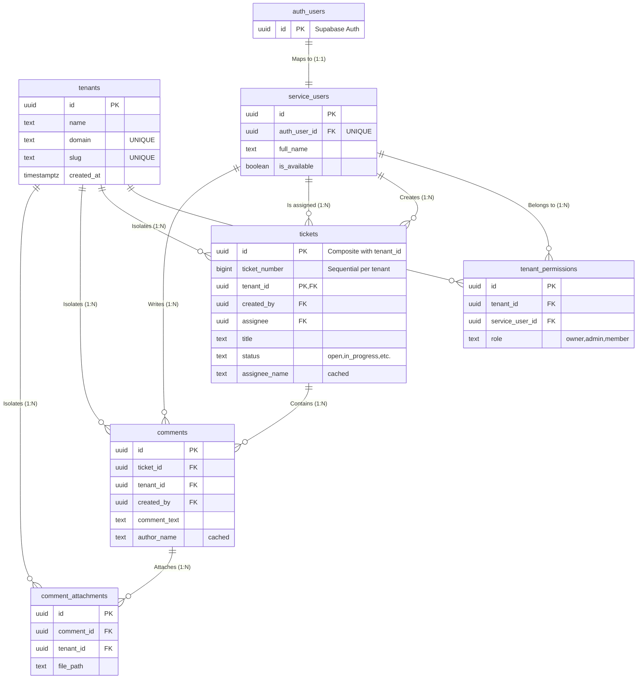

# DEMO TICKET SYSTEM TO TEST SUPABASE AND NEXT.JS CAPABILITIES

Scalable ticket system that allows multiple organizations (tenants) to operate in isolation under their own subdomains. The project demonstrates mastery of modern architectures where Next.js Middleware acts as an intelligent traffic orchestrator.

Users can register in specific tenants, create tickets, and manage their workflow. Security is hardened: only the author can delete or close a ticket, while collaboration is enhanced with a real-time comments feed and file uploads, all running on a distributed Edge infrastructure with Cloudflare Workers.

---

## 🛠️ Tools Used

- **🚀 Framework:** Next.js 16 (App Router) for high-performance hybrid rendering.
- **🐘 Database:** PostgreSQL on **Supabase** with logical partitioning strategies for scalability, migrations via CLI.
- **🌐 Infrastructure:** **Cloudflare Workers** for deploying the Middleware and Subdomain Proxy on the *Edge*.
- **🛡️ Security:** Auth (SSR), custom **JWT Claims**, and **RLS** (Row Level Security) policies for total isolation.
- **⚡ Real-time:** WebSockets via **Supabase Realtime** for instant comment updates.
- **🎨 UI/UX:** **Shadcn/ui** components with **Tailwind CSS**, designed to be minimalist, modern, and consistent.
- **📸 Image Optimization:** Dynamic processing with **Sharp** on the Edge for efficient resizing.
- **💾 Error Management:** Logging system with **manual rollback** in critical transactions to ensure data integrity.

---

## 🚀 Main Features (Core Features)

### 🏢 Multi-tenant Architecture & Edge Infrastructure

- **🌐 Dynamic Subdomain System:** Implementation of an **Edge Proxy** using Next.js Middleware, allowing complete isolation of brands and data per client (e.g., `company.saas.com`).
- **⚡ Deployment on Cloudflare Workers:** Optimized Middleware running at the edge, reducing redirection latency to milliseconds.
- **📂 Database Partitioning:** Use of **PostgreSQL Partitioning** on the tickets table by `tenant_id`, ensuring consistent performance even with millions of records.

### 🎫 Ticket Management & Workflow

- **🛠️ Granular State Control:** State system (Open, In Progress, Completed, etc.) with **optimistic updates** in the UI for instant response.
- **👤 Intelligent Assignment:** Ability to change the responsible person (*assignee*) for each ticket with automatic synchronization of names and availability.
- **🔍 Advanced URL-based Filtering:** Persistent search filters that use the URL as the source of truth, allowing specific views to be shared among team members.

### 💬 Collaboration & Real-time

- **💬 Real-time Comments:** Interactive comment feed using **WebSockets (Supabase Realtime)** for collaboration without page reloads.
- **📎 Attachment Management:** Integrated file upload system with **Supabase Storage** and attachment visualization per comment.
- **📸 Dynamic Image CDN:** Server-side image processing and resizing using **Sharp**, optimizing bandwidth according to the device.

### 🔐 Security & Resilience

- **🛡️ Row-Level Security (RLS):** Database policies that ensure a user can **only** see and edit what belongs to them according to their Tenant and Role.
- **🔑 Secure SSR Authentication:** Server-side session handling (Server-Side Rendering) to avoid security breaches and improve SEO.
- **🔄 Registration with Manual Rollback:** Robust "Sign Up" process that ensures data integrity, reverting changes if a failure occurs during profile or tenant creation.
- **🛠️ Infrastructure as Code (IaC):** Use of Supabase CLI migration flow to ensure the production schema is an exact copy of the development environment, facilitating predictable and secure deployments.

### 🎨 UX/UI & Performance

- **📱 100% Responsive Design:** Adaptive interface built with **Tailwind CSS**, offering a fluid experience from smartphones to ultrawide monitors.
- **🌓 Modern Components:** UI library based on **Shadcn/ui**, guaranteeing accessibility (A11y) and a professional minimalist aesthetic.
- **⏳ Progressive Loading (Streaming):** Use of `loading.tsx` and **React Suspense** to display loading skeletons, improving user-perceived speed.
- **📦 Intelligent Caching (ISR):** Implementation of **Incremental Static Regeneration** for success pages and landing pages, maximizing CDN usage.

---

## Screenshot



---

## Theory Applied to Practice from the Book

- [Building Production-Grade Web Applications with Supabase: A comprehensive guide to database design, security, real-time data, storage, multi-tenancy, and more by David Lorenz](https://www.amazon.com/Building-Production-Grade-Applications-Supabase-comprehensive/dp/1837630682)



---

## Database Schema

ERD diagram representing the tables used. The tickets table has partitioning per tenant to support large amounts of data, and this is an example of a multi-tenant structure where the tenant is the orchestrator of the entire app in terms of RLS permissions.

### Database Relationship Diagram (Mermaid)



### Key Design Points

- **Multi-tenant Isolation:** The `tenants` table is the root. Critical tables (`tickets`, `comments`, `comment_attachments`) include `tenant_id` to guarantee data isolation through RLS (Row Level Security) policies.
- **Ticket Partitioning:** The `tickets` table is partitioned by `LIST (tenant_id)`, which optimizes performance and data management at scale. Its Primary Key is composite: `(id, tenant_id)`.
- **Composite Integrity:** Comments relate to tickets using a composite foreign key `(ticket_id, tenant_id)` to ensure a comment cannot belong to a ticket from another client.
- **Strategic Denormalization:** Cache fields such as `author_name` in `comments` and `assignee_name` in `tickets` are used.

---

## Next.js Project Structure (src folder)

Front-end folder structure with Next.js 16 App Router. React components are located in the features folder to keep the app folder only with demo routes.

```js
src                                        //   
├─ app                                     //   ROUTES LAYER (App Router)
│  ├─ favicon.ico                          //   
│  ├─ globals.css                          //   Global ShadCN CSS
│  ├─ layout.tsx                           //   -RootLayout (static SERVER LAYOUT COMPONENT)
│  ├─ loading.tsx                          //   Loading (static SERVER COMPONENT)
│  ├─ not-found                            //   
│  │  └─ page.tsx                          //   PageNotFound (static SERVER COMPONENT)
│  ├─ not-found.tsx                        //   NotFound (static SERVER COMPONENT)
│  ├─ page.tsx                             //   Home (static SERVER COMPONENT) Landing page with list of available tenants
│  └─ [tenant]                             //   [tenant] This is the main route where the proxy (next middleware) redirects according to the host
│     ├─ auth                              //   
│     │  ├─ confirm                        //
│     │  │  └─ route.ts                    //   GET (ROUTE HANDLER) Receives magic link and confirmation calls sent by email
│     │  ├─ forgot-password                //
│     │  │  └─ page.tsx                    //   ForgotPasswordPage (dynamic SERVER COMPONENT)
│     │  ├─ login                          //
│     │  │  ├─ api                         //
│     │  │  │  └─ route.ts                 //   POST (ROUTE HANDLER) Processes login when JavaScript is disabled in the browser
│     │  │  └─ page.tsx                    //   Login (dynamic SERVER COMPONENT) Uses getClaims to verify user and load components
│     │  ├─ login-magic-link               //
│     │  │  └─ api                         //
│     │  │     └─ route.ts                 //   GET (ROUTE HANDLER) Not used for now, only returns a message
│     │  ├─ logout                         //
│     │  │  └─ api                         //
│     │  │     └─ route.ts                 //   POST (ROUTE HANDLER) Handles logout when JavaScript is disabled in the browser
│     │  ├─ magic-thanks                   //
│     │  │  └─ page.tsx                    //   MagicLinkSuccessPage (ISR dynamic SERVER COMPONENT) Message that the magicLink email was sent
│     │  ├─ page.tsx                       //   AuthPage (static SERVER COMPONENT) Redirects to tickets if someone visits [tenant]/auth
│     │  ├─ update-password                //   
│     │  │  └─ page.tsx                    //   UpdatePasswordFormPage (static SERVER COMPONENT) Route to update password from a 
│     │  └─ verify-oauth                   //
│     │     └─ api                         //
│     │        └─ route.ts                 //   GET (ROUTE HANDLER) Verifies redirect when logging in via Google
│     ├─ cdn                               //
│     │  └─ api                            //
│     │     └─ route.ts                    //   GET (ROUTE HANDLER) Processes an image with Sharp and returns it resized
│     ├─ error                             //
│     │  └─ page.tsx                       //   ErrorPage (dynamic SERVER COMPONENT) Page where DB query errors are redirected
│     ├─ layout.tsx                        //   - TenantLayout (dynamic SERVER COMPONENT) This layout checks if the logged-in user belongs to the tenant
│     ├─ page.tsx                          //   TenantPage (static SERVER COMPONENT) Automatically redirects to /tickets if the user visits /[tenant]
│     ├─ register                          //
│     │  ├─ api                            //
│     │  │  └─ route.ts                    //   POST (ROUTE HANDLER) Processes new registration with manual rollback in case of errors.
│     │  └─ page.tsx                       //   RegisterPage (dynamic SERVER COMPONENT) Page to register a new user under a specific tenant
│     └─ tickets                           //
│        ├─ details                        //
│        │  └─ [slugId]                    //
│        │     └─ page.tsx                 //   TicketDetailPage (dynamic SERVER COMPONENT) Extracts information used to render ticket details
│        ├─ layout.tsx                     //   -TicketsLayout (static SERVER COMPONENT) Layout that controls the protected tickets area
│        ├─ new                            //
│        │  └─ page.tsx                    //   CreateTicketPage (static SERVER COMPONENT) 
│        ├─ page.tsx                       //   TicketsPage (dynamic SERVER COMPONENT) This page has the title and loads the tickets table.
│        └─ users                          //
│           └─ page.tsx                    //   UserList (dynamic SERVER COMPONENT) Fetches tenant info, user list, and current user to render the list with a select
├─ components                              //   SHADCN COMPONENTS
│  └─ ui                                   //
│     ├─ badge.tsx                         //   
│     ├─ button.tsx                        //
│     ├─ card.tsx                          //
│     ├─ drawer.tsx                        //
│     ├─ input.tsx                         //
│     ├─ label.tsx                         //
│     ├─ navigation-menu.tsx               //
│     └─ select.tsx                        //
├─ features                                //   BUSINESS LOGIC LAYER (Domain Driven)
│  ├─ auth                                 //
│  │  └─ components                        //
│  │     ├─ AuthListener.tsx               //   AuthListener (CLIENT COMPONENT) useEffect present. Component that loads a session watcher
│  │     ├─ forgot-password-form.tsx       //   ForgotPasswordForm (CLIENT COMPONENT) Form to send password recovery magic link email
│  │     ├─ LoginForm.tsx                  //   LoginForm (CLIENT COMPONENTS) Tenant-separated login form
│  │     └─ update-password-form.tsx       //   UpdatePasswordForm (CLIENT COMPONENT) Small form after magic link to change password
│  ├─ register                             //
│  │  └─ components                        //
│  │     └─ SignUpForm.tsx                 //   SignUpForm (CLIENT COMPONENT) Sign up form for new users under a particular tenant
│  └─ tickets                              //
│     └─ components                        //
│        ├─ AssigneeSelect.tsx             //   AssigneeSelect (SERVER COMPONENT) Renders the select to assign or change the ticket assignee
│        ├─ AssigneeWrapper.tsx            //   AssigneeWrapper (CLIENT COMPONENT) Wrapper to keep AssigneeSelect as server (not the best idea)
│        ├─ AvailabilitySelect.tsx         //   AvailabilitySelect (CLIENT COMPONENT) Select to set user availability in the USERS table
│        ├─ CreateTicketForm.tsx           //   CreateTicketForm (CLIENT COMPONENT) Form for creating a new ticket
│        ├─ DeleteButton.tsx               //   DeleteButton (CLIENT COMPONENT) Button to delete a ticket visible only to the creator
│        ├─ LogoutButton.tsx               //   LogoutButton (CLIENT COMPONENT) Logout button located in the navbar
│        ├─ NavBar                         //
│        │  ├─ MobileMenu.tsx              //   MobileMenu (SERVER COMPONENT) Menu visible only on mobile version
│        │  └─ Navbar.tsx                  //   Navbar (SERVER COMPONENT) Simple navigation menu
│        ├─ TenantName.tsx                 //   TenantName (CLIENT COMPONENT) useEffect present. Demo component for useEffect and loading state
│        ├─ ticketComment.tsx              //   TicketComments (CLIENT COMPONENT) Complex component that handles not only comments but also attached files
│        ├─ TicketList.tsx                 //   TicketList (SERVER COMPONENT) Renders the table with a basic pagination system.
│        ├─ TicketsFilter.tsx              //   TicketFilters (CLIENT COMPONENT) Search filter whose state is saved in the URL
│        └─ TicketStatusSelect.tsx         //   TicketStatusSelect (CLIENT COMPONENT) Select that handles changing the ticket status, only the creator can change it
├─ lib                                     //   INFRASTRUCTURE LAYER (Core Services)
│  ├─ dbFunctions                          //
│  │  └─ fetch_tenant_domain_cached.ts     //   fetchTenantDataCached (SERVER ACTION) Example of cached request and request memoization
│  ├─ server_actions                       //
│  │  └─ emails.ts                         //   Resend email functions are here
│  ├─ supabase                             //
│  │  ├─ admin.ts                          //   createSupabaseAdminClient (SUPABASE SERVICE KEY CLIENT) Supabase client that EXPOSES the service key.
│  │  ├─ client.ts                         //   createSupabaseBrowserClient (SUPABASE BROWSER) Supabase client to use in client components
│  │  ├─ proxy.ts                          //   Supabase proxy (middleware) that filters every request and rewrites the route for multi-tenancy
│  │  └─ server.ts                         //   createServerClient (SUPABASE SERVER) Supabase client to use in server components
│  └─ utils.ts                             //   Special Tailwind functions (cn dependency)
├─ proxy.ts                                //   Main Next.js proxy that passes the request to the special Supabase proxy
├─ types                                   //   
└─ utils                                   //   Types generated by Supabase CLI
   └─ url-helpers.ts                       //   Functions that rebuild absolute routes to include the tenant in the host.

```

---

## Supabase Project Structure (supabase folder)

Migrations are located in the migrations folder, but for better understanding the entire schema is in this directory. Each migration includes the corresponding modification in this schema.

```js
schemas                                                            //
├─ buckets                                                         //
│  ├─ comments_attachments.sql                                     //
│  └─ tickets_attachment.sql                                       //
├─ db_configurations                                               //
│  └─ time_zone.sql                                                //   Configuration to set the local time where I am located
├─ functions                                                       //   RPC functions called from the front-end
│  ├─ funciton_get_service_users_with_tenant.sql                   //
│  ├─ function_get_tenant_data.sql                                 //
│  └─ internal_functions                                           //   Functions used in triggers to populate data in certain tables
│     ├─ function_derive_tenant_from_ticket-table-comments.sql     //
│     ├─ function_set_comment_author_name.sql                      //
│     ├─ function_set_created-by_value_table-tickets.sql           //
│     ├─ function_set_created_by_value-table_comments.sql          //
│     ├─ function_set_next_ticket_number.sql                       //
│     ├─ function_set_ticket_assignee_name.sql                     //
│     └─ function_set_updated_at.sql                               //
├─ seed.sql                                                        //   Basic seed with DEMO tenants
├─ tables                                                          //
│  ├─ comments.sql                                                 //
│  ├─ comments_attachments.sql                                     //
│  ├─ service_users.sql                                            //
│  ├─ tables_partitions.sql                                        //
│  ├─ tenants.sql                                                  //
│  ├─ tenant_permissions.sql                                       //
│  └─ tickets.sql                                                  //
└─ triggers                                                        //
   ├─ triggers_comments.sql                                        //
   ├─ triggers_comment_attachments.sql                             //
   ├─ triggers_service_users.sql                                   //
   ├─ triggers_tenants.sql                                         //
   ├─ triggers_tenants_permissions.sql                             //
   └─ triggers_tickets.sql                                         //

```

---

## License

This project is licensed under the MIT License - see the [LICENSE](LICENSE) file for details.

---

## Contact

For any questions or recommendations

- **Email**: [spjhon@gmail.com](spjhon@gmail.com)
- **GitHub**: [github.com/spjhon](https://github.com/spjhon)

---

## CLI Commands I Use Frequently

Local Types Generation: `pnpx supabase gen types typescript --local > supabase/types/database.types.ts`
Make full local system backup: `pnpx supabase db dump --local > backup_completo.sql`
To link with established env: `pnpx supabase link --project-ref hborskybnjzxsazqhhex -- pnpx supabase link --project-ref qwtpfbwovcvybtfzdbcd`

---

## Bugs to Organize

1. The max() function of one of the rpc functions is not efficient with large volumes
2.
3.
4. If the invitation link is sent after registration, if the magic link fails, there is no other way to resend it and the user is already registered, it would not be activated.
5.
6.
7. Fix the URL when using the search option
8. In start mode, when logging in and there are no credentials, if the correct credentials are entered, nothing happens.
9. Set it up so that password change requires email confirmation so that if someone obtains the password, they cannot change it unless there is email confirmation
10. If you try to log in to another tenant and get an error that the tenant is not compatible, the session will be invalidated elsewhere

---

## Pending Tasks

1. Move everything possible to RPC
2. Better error handling (use toasts)
3. -
4. -
5. Review the RLS of the comments_attachments bucket to not only block by tenant but also by ticket and even by comment.
6. It is recommended in multi-tenant architecture to leave the tenant in all tables so that the RLS policy is easier, and to use a trigger to add this tenant in the tables where needed based on other fields and uid().
7. -
8. -
9. -
10. Regarding image resizing, Supabase work costs money but you can, for example, transform them on the client before uploading and upload the images to the database already ready.
11. Do not forget the security tips from the last two chapters of the book, including security for the created_at columns to prevent them from being modified on update
12. Database rate limiting can be implemented with Supabase's special middleware for all API calls
13. Protection so that only the desired IP listens
14. Force SSL
15. Vector search via AI and saving embeddings in tables
16. Supabase has something called wrappers for inserting external tables into the database and thus being able to query and insert information, very useful for a payment system.
17. -
18. Cron jobs
19. JSON validation with the pj_jsonschema extension, very useful in RPC validations
20. Disable GraphQL and other things when not needed.
21. -
22. -
23. Change alerts for toasts

24. Add the tour
25. Implement dark/light mode
26. Implement internationalization

## Future Performance Improvements

1. Use a library called jose to capture the JWT in the middleware and check the info for permissions instead of making a database call for every request that passes through the middleware.

---
